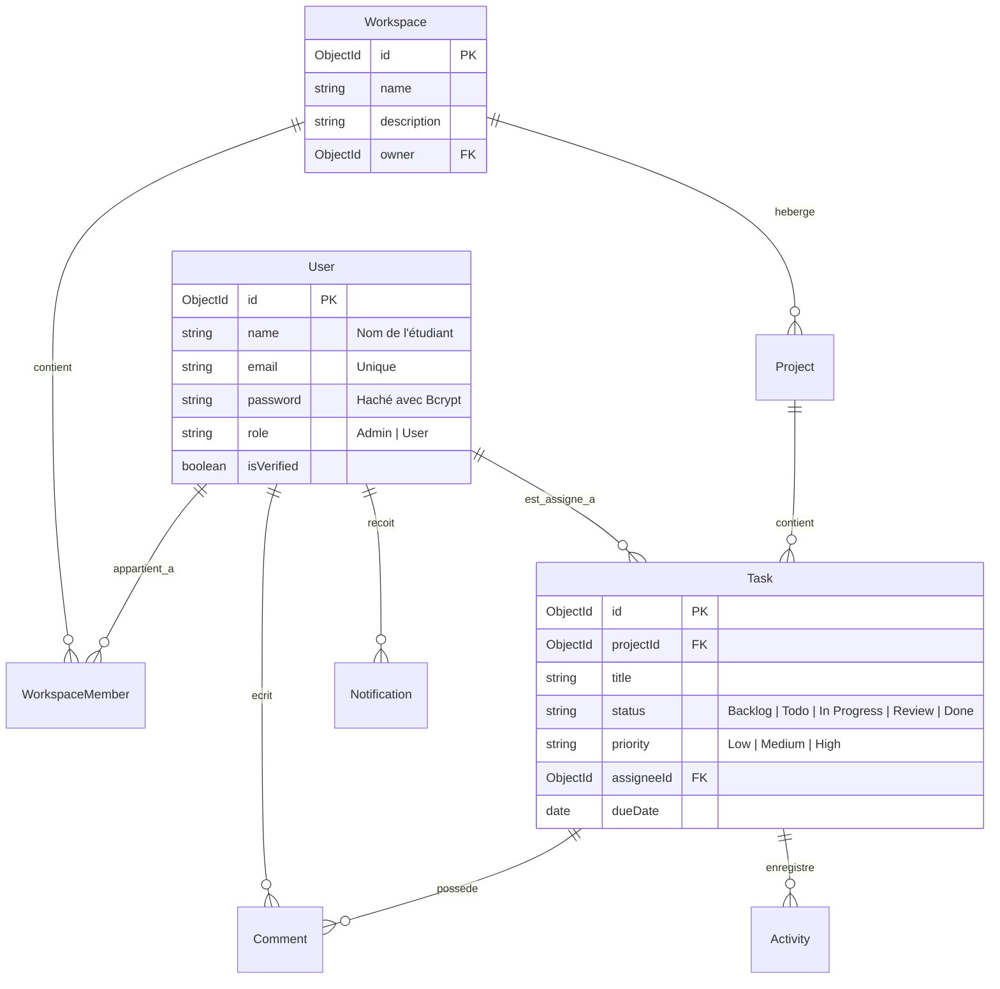

# Rapport de Projet Académique : TaskFlow AI
**Plateforme Collaborative de Gestion de Projet avec Modules d'Intelligence Artificielle**

*Présentation de Soutenance de Projet de Fin d'Études (PFE / TP)*  
*Technologies : MERN Stack (MongoDB, Express, React, Node.js), Socket.io, Tailwind CSS, OpenAI*

---

## 1. Introduction et Objectifs du Projet

**TaskFlow AI** est une application web moderne de gestion de projet collaborative inspirée d'outils industriels tels que **Jira**, **Trello** et **Notion**. Le projet a été conçu pour structurer et fluidifier le travail d'une équipe de développement ou d'ingénierie logicielle.

### Objectifs Principaux
1. **Collaboration en Temps Réel :** Synchronisation immédiate des modifications de tâches, des commentaires et des notifications d'affectation sans rechargement de page.
2. **Architecture Propre (Clean Architecture) :** Séparation stricte des règles métier et des frameworks techniques pour assurer l'indépendance de la base de données et de l'interface graphique.
3. **Intégration de l'IA (IA Copilot) :** Automatisation de tâches répétitives (rédaction de descriptions, estimation de complexité, suggestion de priorités) et génération de rapports de vélocité.

---

## 2. Découpage Modulaire (Projet Réalisé par 3 Développeurs)

Pour répondre aux exigences d'un travail d'équipe académique, l'application est découpée en **3 modules indépendants et interconnectés** :

### Développeur 1 : Module Authentification & Gestion des Utilisateurs
*   **Fonctionnalités Clés :** Inscription, Connexion sécurisée avec génération de jetons JWT, cycle de validation d'email (activation de compte), récupération de mot de passe par mail, gestion du profil utilisateur et des rôles système (`Admin` / `User`).
*   **Technologies :** JWT, BcryptJS pour le hachage sécurisé, Nodemailer pour la messagerie, React Hook Form.

### Développeur 2 : Module Workspace & Gestion Kanban des Tâches
*   **Fonctionnalités Clés :** Création d'espaces de travail (Workspaces) et invitation de membres, création de projets, tableau Kanban interactif avec transitions d'états (*Backlog, Todo, In Progress, Review, Done*), filtres par priorité, recherche textuelle et assignation de tâches.
*   **Technologies :** Mongoose, Tailwind CSS pour l'ergonomie responsive, React Router pour la navigation.

### Développeur 3 : Module Collaboration en Temps Réel & IA Copilot
*   **Fonctionnalités Clés :** Fil de discussion (commentaires), notifications d'activité en temps réel via WebSockets, intégration de l'API OpenAI pour l'aide à la décision (priorités, descriptions, estimations de points Fibonacci, rapports de productivité).
*   **Technologies :** Socket.io (Client et Serveur), SDK OpenAI, Heuristiques sémantiques locales pour le mode simulation (mock).

---

## 3. Architecture Technique du Projet

### Backend : Patron Clean Architecture
Le backend suit une architecture en couches concentriques où les dépendances pointent uniquement vers l'intérieur :

```
backend/src/
├── domain/                      # COEUR MÉTIER (Indépendant de tout framework)
│   ├── entities/                # Modèles de données purs (User, Task, Workspace)
│   └── repositories/            # Contrats / Interfaces d'accès aux données
├── application/                 # CAS D'UTILISATION (Règles applicatives)
│   ├── use-cases/               # Orchestrateurs (LoginUser, CreateTask, etc.)
│   └── services/                # Interfaces des services (Mail, Token, AI)
├── infrastructure/              # ADAPTATEURS (Frameworks et Outils externes)
│   ├── database/                # Schémas Mongoose & Modèles de données
│   ├── repositories/            # Implémentations concrètes des Repositories
│   ├── security/                # Chiffrement Bcrypt et Jetons JWT
│   ├── email/                   # Envoi d'emails via SMTP ou Console Mock
│   └── ai/                      # Client OpenAI et Simulations sémantiques
└── presentation/                # DRIVER D'ENTRÉE (Serveur HTTP et WebSockets)
    ├── controllers/             # Contrôleurs Express
    ├── routes/                  # Définitions des routes API REST
    ├── middlewares/             # Sécurité JWT, Validation, Rôle d'accès
    └── socket/                  # Gestionnaire de connexions Socket.io
```

*Avantage pour la soutenance :* Démontre une parfaite maîtrise des patrons de conception logiciels (Repository Pattern, Dependency Injection, Service Layer) conformes aux exigences professionnelles.

### Frontend : Structure React moderne
*   **Build Tool :** Vite (rapide, léger, compilations optimisées).
*   **State Management :** Context API (`AuthContext`, `SocketContext`, `NotificationContext`) pour centraliser les sessions et les flux de notifications.
*   **Styling :** Tailwind CSS avec une charte graphique sombre et moderne en verre poli (Glassmorphism) et animations de boutons luisants (Glow effects).

---

## 4. Modèle de Données (Schéma de Base de Données)

Le schéma ci-dessous modélise l'architecture MongoDB conçue pour l'application :



---

## 5. Fonctionnalités d'Intelligence Artificielle

L'assistant IA de **TaskFlow AI** utilise le modèle `gpt-3.5-turbo` d'OpenAI. Afin d'assurer un fonctionnement sans faille lors de la présentation orale (sans dépendances de connexion ou de facturation d'API), un **mode simulation intelligent (Mock Mode)** a été implémenté au cœur du service :

1.  **Génération de Descriptions de Tâches :** L'utilisateur saisit un titre (ex: *"Setup Database"*), l'IA propose instantanément 3 puces d'actions techniques adaptées.
2.  **Estimation de Complexité (Fibonacci Points) :** L'IA estime la complexité de développement (1, 2, 3, 5 ou 8 points) et justifie son choix en fonction du contenu de la tâche.
3.  **Suggestion de Priorité :** Analyse sémantique des mots-clés d'urgence (ex: *"crash"*, *"bug urgent"* attribuent automatiquement la priorité **High**).
4.  **Rapport Hebdomadaire de Productivité :** Analyse la répartition des tâches du Workspace et génère des recommandations managériales (ex: détecter les goulots d'étranglement).

---

## 6. Processus de Validation et Métriques de Qualité

*   **Validation des Types et Formulaires :** Utilisation de `react-hook-form` pour la réactivité, et `express-validator` sur le backend pour rejeter les requêtes incorrectes à l'entrée de l'API.
*   **Sécurité d'Accès :** Middlewares d'autorisation vérifiant la validité du JWT et la correspondance des rôles d'accès pour les routes de statistiques d'administration.
*   **Compilation de Production :** Validée avec succès via Vite (`vite build`) en générant des fichiers statiques légers (bundle JS de 400 kB).
*   **Tests Métier unitaires :** Exécution et réussite de tests unitaires sur les cas d'utilisation métier (`npm run test`) validant la robustesse du code de gestion utilisateur et du hachage de mot de passe.
